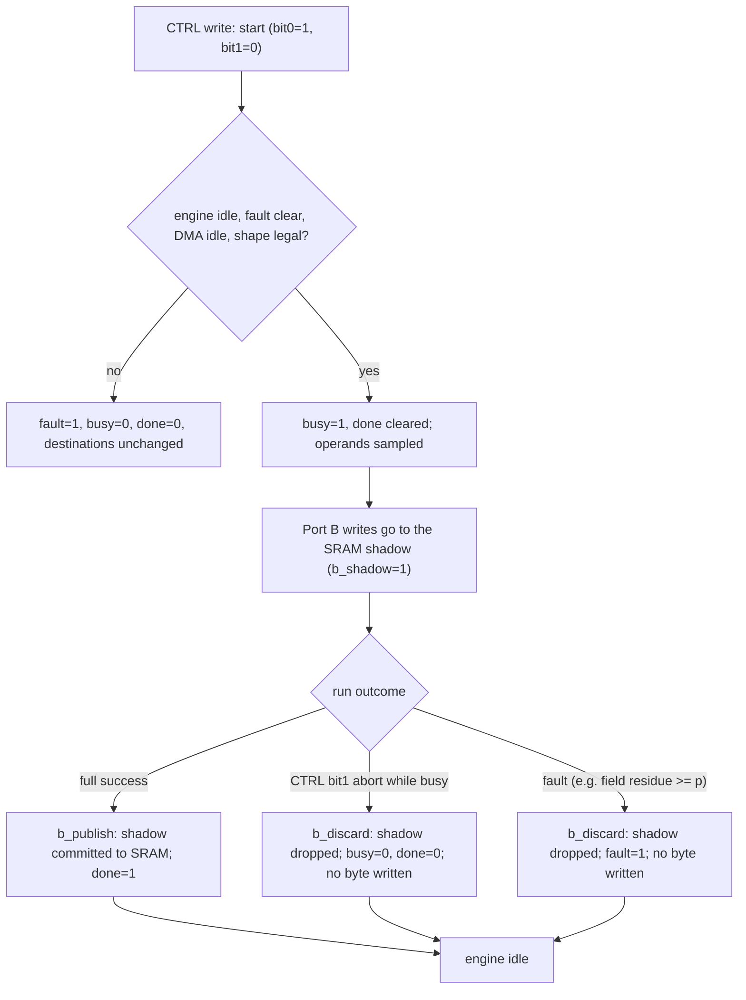
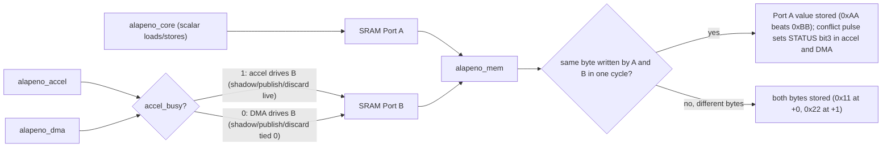
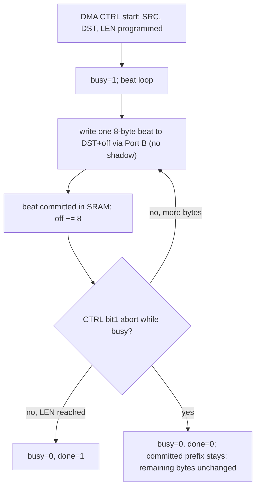
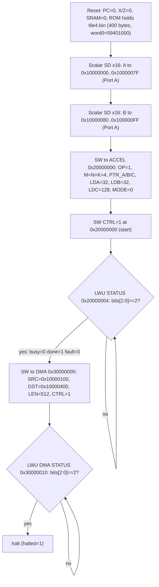

<!-- SPDX-License-Identifier: AGPL-3.0-only -->
<!-- Copyright (C) 2026 Alapeno contributors -->

# Alapeno V1: hardware README and release notes (RTL and verification drop)

**Verdict.** Alapeno V1 is a reproducible RTL-and-verification drop at commit `5dda740` on `main`. It is not a chip, a tapeout, or a silicon product. What V1 contains is SystemVerilog for a small integer machine: a scalar core, a matrix/vector accelerator behind MMIO, a DMA engine, and a two-port SRAM model. It also contains Icarus Verilog testbenches whose logs show one frozen non-field 4x4x4 integer MATMUL running end to end from a 400-byte ROM image. That run produced 512 bytes of C that matched the expected matrix bit for bit. Next to the RTL are Why3 models (some goals printed Valid, others only stated), generic-gate Yosys statistics, and a handful of illustrative ngspice decks that use Level-1 MOSFET cards. Every number in this file comes from a log, a source file, or git metadata in the repository, and the file names where it came from. Where something was not measured, the file says so. The most important caveats are these. The RTL simulation logs were all produced *before* the final RTL commit `5dda740`, and no log in the tree shows that commit's RTL being simulated. The lemma `tile_k4_cannot_overflow` is stated in Why3, but no verification log shows it printed Valid. No timing, frequency, area, power, or silicon measurement exists anywhere in this drop.

This file lives at `verification/HARDWARE_V1.md`. It does not replace the 311-word repository-root `README.md`, and it does not edit `spec/`, `why3/`, or `rtl/`. When it was written, this file was **uncommitted**. HEAD was `5dda740b277bb2f2219ca4108664e0df9ce378b3`, which matched `origin/main`, and the working tree was clean before this file was added.

---

## 1. What "V1" means here

The word "production" in "production-V1" needs a precise meaning, because hardware readers will reasonably expect it to mean a part they can buy, or at least a netlist that closed timing against a foundry library. It means neither. In this repository, V1 is the first point at which these three things are true together:

1. The architectural contract for one integer compute tile is frozen in prose (`spec/accelerator/TILE.md`), next to the accelerator, memory, ISA and arithmetic specs it defers to.
2. A host program for that tile exists as assembly (`compiler/tile4.s`, 121 lines, 3197 bytes). An assembler (`compiler/alapeno_as.c`, 18907 bytes) turns it into a binary, `verification/rtl/tile4.bin`, which is 400 bytes, or 100 32-bit instructions.
3. That exact binary was loaded unchanged into ROM of the `alapeno_top` RTL under Icarus Verilog. The core ran it to `halted=1`, and the 512-byte copy of the result matched the expected integers (`verification/rtl/logs/tile4_rom.log`).

Around that spine sit three protocol benches (accelerator abort, Port A contest, DMA abort), a module-level matrix differential bench, a 4-bit MAC reference check, two Why3 log dumps, two Yosys statistics logs, and three ngspice transient logs. V1 is the bundle of all of these at one commit, with an honest account of which pieces were measured and which were not.

The release is reproducible in the sense that every simulation log records the `iverilog` and `vvp` command lines it used (except `mac_ref.log`, which records only results). A reader who has Icarus Verilog can therefore rerun the same commands against the same sources. Section 9 explains why the result at HEAD is not guaranteed to match the logs. Briefly, the last commit changed RTL after the logs were written.

---

## 2. The architectural contract in one place

The specs are the source of truth, and this README only restates what they lock. The tile is defined in `spec/accelerator/TILE.md`. That file says it "does not redefine the accelerator contract" and that "Where any fact here would contradict `spec/accelerator/ACCELERATOR.md`, ACCELERATOR.md wins."

### 2.1 Number formats

This is an integer machine. TILE.md is explicit: "The machine must not switch to INT8 or INT32. There is no IEEE float." The A and B operands of the tile are signed 64-bit little-endian elements, each 8 bytes wide. Each C element is a signed 256-bit little-endian tuple of four 64-bit limbs, 32 bytes wide. The representable signed-256 range is `[-2^255, 2^255 - 1]`. The machine has a field mode over the Goldilocks prime `p = 18446744069414584321`, which `rtl/core/alapeno_pkg.sv` carries as `P = 64'hFFFF_FFFF_0000_0001`, but the frozen tile does not use field mode (`MODE = 0`). The scalar side has registers X0..X31 and signed 256-bit accumulators Z0..Z7. The scalar multiply-accumulate instruction ZMAC is opcode `0x18`, funct3 6. In the core, the major opcode is decoded from `instr[31:26]`.

### 2.2 The frozen operation

TILE.md section 1 freezes exactly one operation:

| Parameter | Frozen value |
| --- | --- |
| OP | 1 (MATMUL) |
| MODE | 0 (non-field) |
| M, N, K | 4, 4, 4 |
| A, B element | signed 64-bit LE, width 8 |
| C element | signed 256-bit LE limb tuple, width 32 |

The tile excludes field mode, ROUTE, PROJECT, VADD, VSUB, RED.*, and empty shapes. Those operations remain defined by ACCELERATOR.md, but V1 does not exercise them at the top level. Section 10 lists what that means for coverage.

### 2.3 All-or-nothing publish

The accelerator's central hardware promise is that a result is published completely or not at all. ACCELERATOR.md section 2 states it: "CTRL bit 1 = 1 while busy aborts. Abort must return the engine to idle with no destination write of any byte. Accelerator completion is all-or-nothing." The same section requires that a whole-shape check failure leaves "busy = 0, done = 0, fault = 1, destinations unchanged."

The RTL implements this with a shadow mechanism in the SRAM model. The accelerator drives Port B with `b_shadow`, `b_publish` and `b_discard` strobes (visible in `rtl/alapeno_top.sv`). Writes marked as shadow stay in a side buffer, a publish strobe commits them, and a discard drops them. The top-level mux passes those strobes through only while the accelerator is busy. When the DMA owns Port B, the top level ties `b_shadow`, `b_publish` and `b_discard` to zero, so DMA writes commit directly. That difference is deliberate, and Section 6.5 returns to it.



*Figure 1. Accelerator publish path. The shadow is published only on full success, and an abort or fault drops it. The abort branch is exercised by `accel_abort.log` and `les_diff.log`. The field-residue fault branch is exercised at the `alapeno_matrix` level by `les_diff.log`.*

### 2.4 Memory ports and the same-byte contest

`spec/memory/MEMORY.md` defines a two-port SRAM. Port A belongs to the scalar core. Port B belongs to the accelerator while the accelerator is busy, and to the DMA otherwise. The header comment of `rtl/alapeno_top.sv` puts it in one line: "Core on port A. Accelerator owns port B while busy; otherwise DMA may." Because the top-level `always_comb` selects Port B's drivers on `accel_busy`, the accelerator and the DMA can never both drive Port B in the same cycle.

When Port A and Port B write the same byte in the same cycle, MEMORY.md says: "Take address `0x10000000` in a cycle where Port A writes byte `0xAA` and Port B writes byte `0xBB`. The stored byte must be `0xAA`. A same-cycle read of that byte must return `0xAA`. Both STATUS registers must then have bit 3 set. A write of `0x11` by Port A to `0x10000000` and a write of `0x22` by Port B to `0x10000001` in the same cycle must store both bytes."



*Figure 2. Memory ports. Port A is always the scalar core. Port B has exactly one owner per cycle, chosen by `accel_busy`. Port A wins a same-byte contest. `porta_contest.log` exercises this figure.*

### 2.5 DMA abort keeps the committed prefix

The DMA has the opposite rule from the accelerator. It moves data in 8-byte beats and does not use the shadow. When the DMA is aborted, the beats that were already committed stay in memory, and the bytes that were not yet written stay at their old value. A protocol lemma in `why3/memory.mlw`, `dma_abort_keeps_prefix`, states the same thing, but see Section 8 for what was and was not logged about that lemma.



*Figure 3. DMA abort keeps the committed prefix. `dma_abort.log` shows this with an 8-byte committed prefix and 24 unchanged bytes.*

---

## 3. Programming model (MMIO maps)

The tables below come from `spec/memory/MEMORY.md`, `spec/accelerator/ACCELERATOR.md`, and the RTL decode in `rtl/dma/alapeno_dma.sv`.

### 3.1 Address map

| Region | Range | Size |
| --- | --- | --- |
| ROM | `0x00000000 .. 0x0000FFFF` | 64 KiB |
| SRAM0 | `0x10000000 .. 0x1003FFFF` | 256 KiB |
| SRAM1 | `0x10040000 .. 0x1007FFFF` | 256 KiB |
| ACCEL | `0x20000000 .. 0x20000FFF` | 4 KiB |
| DMA | `0x30000000 .. 0x30000FFF` | 4 KiB |

MEMORY.md: "SRAM0 and SRAM1 together are one contiguous 512 KiB SRAM window, `0x10000000 .. 0x1007FFFF`. Fetch from SRAM1 must trap with cause 3." Accesses to holes trap with cause 3 and are not written.

### 3.2 Accelerator registers (base `0x20000000`)

| Offset | Name | Role (ACCELERATOR.md) |
| --- | --- | --- |
| `0x00` | CTRL | bit 0 start, bit 1 abort. Reads as 0. |
| `0x04` | STATUS | bit 0 busy, bit 1 done, bit 2 fault, bit 3 conflict. |
| `0x08` | OP | operation code |
| `0x0C` | M | unsigned row count |
| `0x10` | N | unsigned column count |
| `0x14` | K | unsigned inner count |
| `0x18` | PTR_A | byte address of operand A |
| `0x1C` | PTR_B | byte address of operand B |
| `0x20` | PTR_C | byte address of C or the projection |
| `0x24` | LDA | row stride of A, bytes |
| `0x28` | LDB | row stride of B, bytes |
| `0x2C` | LDC | row stride of C, bytes |
| `0x30` | VL | vector length |
| `0x34` | MODE | bit 0 field mode; bit 1 must be 0; bits [31:2] must be 0 |

ACCELERATOR.md: "Each register is 32 bits, little-endian, and 4-byte aligned. The scalar core may touch one only with LW, LWU, or SW. Any other access size is a core trap, not an accelerator fault." Undefined offsets inside the window are core cause 3.

### 3.3 DMA registers (base `0x30000000`)

| Offset | Name | Role (MEMORY.md) |
| --- | --- | --- |
| `0x00` | SRC | source byte address |
| `0x04` | DST | destination byte address |
| `0x08` | LEN | byte count |
| `0x0C` | CTRL | bit 0 start, bit 1 abort. Reads as 0. |
| `0x10` | STATUS | bit 0 busy, bit 1 done, bit 2 fault, bit 3 conflict |

TILE.md names the DMA base but not its STATUS offset. The header of `compiler/tile4.s` records how the two were reconciled: "DMA STATUS polled at 0x30000010 (MEMORY.md §5 / rtl/dma/alapeno_dma.sv mmio_addr 12'h010). TILE.md names the DMA base but not the STATUS offset; MEMORY.md and the RTL agree on +0x10." The RTL decode agrees. `alapeno_dma.sv` decodes `12'h000`, `12'h004`, `12'h008`, `12'h00C` and `12'h010`. The DMA is SRAM-to-SRAM only, and a range that leaves `0x10000000 .. 0x1007FFFF` is a fault.

### 3.4 Completion is by polling

The tile uses no interrupts. ACCELERATOR.md: "The core must not take a trap because of an accelerator or DMA fault. Software starts an operation and polls STATUS." In both STATUS registers, the low three bits are busy, done and fault. The host program polls until `bits[2:0] == 2`, which means `busy=0, done=1, fault=0`.

---

## 4. Demo: the frozen 4x4 integer tile

This section walks through the one workload V1 actually runs at the top level.

### 4.1 The matrices

TILE.md section 3 seeds the operands from a small LCG (`LCGA = 48271`, `LCGM = 2147483647`, `SEED0 = 20261002`, `RADIX = 5`). That makes every element an integer in `0 .. 4`. The exact matrices are:

```
A = 2 4 0 0        B = 1 3 2 2        C = A x B = 18 18 12 16
    3 3 0 4            4 3 2 3                    23 22 12 19
    3 3 3 2            0 3 2 4                    19 29 18 29
    2 1 2 0            2 1 0 1                     6 15 10 15
```

Each `C[m, n]` is the exact mathematical integer `sum_{k=0}^{3} A[m, k] * B[k, n]`. To check one entry by hand: `C[0,0] = 2*1 + 4*4 + 0*0 + 0*2 = 18`, and `C[2,1] = 3*3 + 3*3 + 3*3 + 2*1 = 29`. No modular reduction is involved, because MODE is 0.

### 4.2 Placement and strides

| Name | Address | Bytes | Stride |
| --- | --- | --- | --- |
| PTR_A | `0x10000000` | 128 | LDA = 32 |
| PTR_B | `0x10000080` | 128 | LDB = 32 |
| PTR_C | `0x10000100` | 512 | LDC = 128 |
| PTR_C_COPY | `0x10000400` | 512 | (DMA copy target) |

Element `(r, c)` of a pointer `P` with stride `S` and element width `W` is at `P + r*S + c*W`. For A, that is `0x10000000 + 32r + 8c`. With K = 4, the four 8-byte elements of a row fill the 32-byte stride exactly, so A is dense, and B is the same. For C, the address is `0x10000100 + 128r + 32c`. Each row holds four 32-byte elements, so the 128-byte LDC is also dense. All four rectangles lie inside SRAM0, and none of them overlap.

### 4.3 Limb layout of C

Each C element takes 32 bytes as four little-endian 64-bit limbs. TILE.md: "limb 0 holds the unsigned low 64 bits of the two's-complement value; limbs 1..3 are zero for every element of this tile (every entry is in `0 .. 29`)." The integer `v` is therefore stored as the limb tuple `(v, 0, 0, 0)`. Sixteen elements times 32 bytes gives the 512 bytes of C, and the copy at `0x10000400` has the same 512 bytes.

The log prints each element as a 256-bit hex word, with the most significant limb first. For example, element 0 (value 18) appears in `tile4_rom.log` as:

```
COPY[0] expected=18 (0000000000000000000000000000000000000000000000000000000000000012) actual=18 (0000000000000000000000000000000000000000000000000000000000000012)
```

and element 9 (value 29) as:

```
COPY[9] expected=29 (000000000000000000000000000000000000000000000000000000000000001d) actual=29 (000000000000000000000000000000000000000000000000000000000000001d)
```

The upper 192 bits are zero in both. That matches the claim that the three upper limbs are 0, and `0x1d` is 29.

### 4.4 The host program

`compiler/tile4.s` is the host sequence from TILE.md section 4, written in Alapeno assembly. The source begins:

```
lui   x10, 0x1000          # x10 = PTR_A = 0x10000000
addi  x11, x0, 2
sd    x11, 0(x10)
```

The assembled `tile4.bin` is 400 bytes, and its first sixteen bytes are `00 10 40 59 02 00 60 41 00 00 6a a1 04 00 60 41`. Read as a little-endian 32-bit word, the first four bytes give `0x59401000`, which is the `word0=59401000` that `tile4_rom.log` prints after loading. The program has five phases:

1. **Load A.** Scalar `sd` stores place the 16 A elements at `0x10000000 + 8*i`. Zero elements are stored from `x0`.
2. **Load B.** `addi x10, x10, 0x80` moves the base to `0x10000080`, and 16 more `sd` stores place B. The DMA is SRAM-to-SRAM only, so the initial fill must go through Port A.
3. **Program the accelerator.** `lui x20, 0x2000` forms the ACCEL base. Then come `sw` writes of OP=1, M=N=K=4, PTR_A, PTR_B, PTR_C, LDA=32, LDB=32, LDC=128 and MODE=0, and finally CTRL=1 to start. VL is not written, because MATMUL does not use it.
4. **Poll accelerator STATUS.** `lwu x16, 0x04(x20)`, mask with 7, and loop until the result equals 2.
5. **DMA copy and halt.** `lui x21, 0x3000` forms the DMA base. The program writes SRC=`0x10000100`, DST=`0x10000400`, LEN=512 and CTRL=1, polls `lwu x16, 0x10(x21)` until `bits[2:0] == 2`, and then executes `halt`.



*Figure 4. Host program flow of `tile4.s`, from ROM through the scalar stores of A and B, the accelerator MMIO writes, the STATUS poll, and the DMA copy to `0x10000400`, ending in halt.*

### 4.5 The result

The testbench `verification/rtl/tb_tile4_rom.sv` reads `tile4.bin` from disk, loads it byte by byte into ROM through the `rom_load_*` port of `alapeno_top`, releases reset, and runs until halt. It then reads the 512 bytes at `0x10000400`. The log lines are:

```
fread tile4.bin bytes=400
loaded tile4.bin unchanged at rom[0] (400 bytes) word0=59401000
stop cycles=621 pc=0000018c tcause=00000000 tpc=00000000 halted=1
OBS accel busy=0 done=1 fault=0
OBS dma busy=0 done=1 fault=0
...
PASS TILE4 ROM: all 512 copy bytes matched at 0x10000400 (tile4.bin loaded unchanged)
vvp_exit 0
```

The run took 621 cycles in the testbench's own count, from release to halt. The final PC was `0x0000018c`, and `tcause` was 0, so no trap occurred. Both engines ended at `busy=0 done=1 fault=0`, and all sixteen `COPY[i]` lines show expected equal to actual. `0x18c` is 396, the byte offset of the last 4-byte word in a 400-byte image, which is consistent with the core halting on the final `halt` instruction. That is an arithmetic observation about the log, not an extra claim about the core.

The 621 is a simulation cycle count on a zero-delay RTL model. It is not a latency in nanoseconds, and no clock frequency exists from which to derive one. Section 10 covers this.

---

## 5. Benchmarks (real log results only)

Every row of the table below comes from a file in `verification/rtl/logs/` or `verification/isa/logs/`. "Cycles" appears only where the log prints a cycle count. "Exit" gives the `iverilog_exit` and `vvp_exit` values that the log prints.

| Bench | Log | What ran | Cycles | Result | iverilog / vvp exit |
| --- | --- | --- | --- | --- | --- |
| tile4_rom | `tile4_rom.log` | `alapeno_top` with the unmodified 400-byte `tile4.bin` in ROM; full host program | 621 (`pc=0000018c`, `halted=1`) | `PASS TILE4 ROM: all 512 copy bytes matched at 0x10000400 (tile4.bin loaded unchanged)` | 0 / 0 |
| tile_top (**not** tile4.s) | `tile_top.log` | `alapeno_top` with a 127-word program from the testbench; ROM word 0 patched to a JAL | 642 (`pc=000001f8`, `halted=1`) | `PASS TILE: all 512 copy bytes matched at 0x10000400` | 0 / 0 |
| les_diff | `les_diff.log` | `alapeno_matrix` alone (with `alapeno_pkg`): reset, 4x4x4 MATMUL, abort, field-residue fault | not logged | `PASS reset`, `PASS LES ... bit-exact`, `PASS abort ... 512 C bytes unchanged`, `PASS field-fault ...` | 0 / 0 |
| accel_abort | `accel_abort.log` | `alapeno_accel` + `alapeno_mem`: start, abort while busy | not logged | `PASS ACCEL ABORT: all 32 destination bytes unchanged at 0x10000020 (seed 5a); shadow product was not published` | 0 / 0 |
| porta_contest | `porta_contest.log` | `alapeno_mem` with `alapeno_dma` and `alapeno_accel` STATUS: same-byte and split-byte writes | not logged | `PASS PORT A: stored 0xAA, same-cycle read mux 0xAA, split 0x11/0x22 both stored, STATUS bit3 set in DMA and accel` | 0 / 0 |
| dma_abort | `dma_abort.log` | `alapeno_dma` + `alapeno_mem`: abort after first beat | not logged | `PASS DMA ABORT: committed prefix 8 bytes kept, remaining 24 bytes unchanged, busy=0 done=0` | 0 / 0 |
| mac_ref | `mac_ref.log` | 4-bit x 4-bit + 8-bit accumulator, wrap mod 256 (`mac_ref.sv`) | not logged | five `check` lines, then `all integer mac vectors matched` | not recorded in the log |
| why3-compile | `why3-compile.log` | `compiler/compile.mlw` goals | n/a | 121 `Prover result is: Valid` lines, 0 non-Valid | n/a |
| why3-isa | `why3-isa.log` | `verification/isa/isa_check.mlw` goals | n/a | 6 goals Valid (listed in Section 8) | n/a |
| Yosys synth | `yosys_synth.log` | `alapeno_tile_ctrl` with `alapeno_mac` and `alapeno_matrix`, generic gates | n/a | `44288 cells` (quoted in Section 7); chip area not recorded in the log | n/a |
| Yosys tile_mem | `yosys_tile_mem.log` | `alapeno_tile_ctrl` with `alapeno_matrix`, `memory` mapped to flip-flops | n/a | `1934683 cells` (quoted in Section 7); chip area not recorded in the log | n/a |

### 5.1 tile4_rom: the V1 headline

This is the only top-level run of the actual `tile4.s` program, and Section 4.5 covers it in full. Its compile command, copied from the log, lists exactly these sources: `alapeno_pkg.sv`, `alapeno_core.sv`, `alapeno_matrix.sv`, `alapeno_vector.sv`, `alapeno_accel.sv`, `alapeno_dma.sv`, `alapeno_mem.sv`, `alapeno_top.sv`, and `tb_tile4_rom.sv`. **`alapeno_tile_ctrl.sv` and `alapeno_mac.sv` are not in that list.** Inside the top-level run, the MATMUL is executed by `alapeno_accel`, which instantiates `alapeno_matrix` and `alapeno_vector`. It is not executed by the standalone tile controller that Yosys synthesized. Section 7 explains why the distinction matters.

### 5.2 tile_top: a different program, labeled as such

`tile_top.log` predates `tile4.s`. It was recorded at 23:03 PT on Oct 3, while `tile4.s` and `tile4.bin` came from commit `91736c9` at 00:22 PT on Oct 4. Its testbench builds a program in Verilog and reports `program words=127 entry=d8000044 spin=d8000000`. It first checks that the core spins harmlessly while the ROM image loads (`PASS spin: pc=0 tcause=0 halted=0 while ROM image loads`). Then it logs `patched rom[0] to d8000044 (JAL x0, +0x44)` and runs to `stop cycles=642 pc=000001f8 ... halted=1`, and the same sixteen COPY lines match. **This is not a run of `tile4.s`.** The program is longer (127 words against 100), it starts through a patched jump, and its cycle count (642) differs from tile4_rom (621). It does show that the same RTL produced the same 512-byte answer under a second, independently written host sequence. Treat it as a regression companion to tile4_rom, not a substitute for it.

### 5.3 les_diff: the matrix engine alone

`les_diff.log` compiles only `alapeno_pkg.sv`, `alapeno_matrix.sv` and `tb_les_diff.sv`. Before the bench itself, the log records two harness probes, and they are worth knowing about. A `$finish(1)` probe gave `vvp_exit 0`, and a `$fatal` probe gave `vvp_exit 1`. In other words, `vvp`'s exit code reflects `$fatal` but not the argument of `$finish`. A zero exit code alone is therefore weak evidence. The PASS lines carry the result. The newer benches state "Failures use $fatal." in their headers (`tb_accel_abort.sv`, `tb_dma_abort.sv`), so a failed check there would show as a non-zero `vvp_exit`. The bench lines:

```
PASS reset: complete=0 fail=0 publish=0 (idle)
PASS LES: 4x4x4 non-field MATMUL C bit-exact (TILE known)
PASS abort: kill while not idle set saw_discard, fail stayed 0, no publish; 512 C bytes unchanged (TILE product)
PASS field-fault: field_mode residue >= p (A[0]=P) raised fail and b_discard; 512 C bytes unchanged (seed 0xA5). Not a MATMUL overflow.
all LES differential checks matched (4x4 C; abort; field residue fault; overflow not a legal-K stimulus)
vvp_exit 0
```

The field-fault check deliberately places `A[0] = P` in field mode, which is a residue that is not reduced, and confirms that the engine fails without publishing. As the log itself says, that is "Not a MATMUL overflow." The bench also prints a note explaining why no overflow stimulus exists:

```
OVF not a tile stimulus: TILE.md section 5. K signed-64 products stay in signed 256 for K <= 2^129-1. This tile K=4. Legal accelerator K <= 64. Cite tile_k4_cannot_overflow (Why3 did not print it Valid) and tile_overflow_faults_without_write for the general rule. No faked M_BAD. No K above 64.
```

Section 8 takes this up. The bench cites the lemma, but by its own words the lemma was not printed Valid.

### 5.4 accel_abort

```
accel busy after start
pre-abort shadow dirty_bytes=32 sram_still_seed=1 b_publish=1 b_discard=0
post-abort busy=0 done=0 fault=0 discard_seen_now=0 publish_now=0
PASS ACCEL ABORT: all 32 destination bytes unchanged at 0x10000020 (seed 5a); shadow product was not published
vvp_exit 0
```

Before the abort, the SRAM shadow held 32 dirty bytes, while the visible SRAM still held the seed `0x5a`. After CTRL bit 1, the engine is idle with `done=0 fault=0`, which matches the ACCELERATOR.md rule that "Abort is not a fault by itself". The 32 destination bytes still read as the seed. The pre-abort line also shows `b_publish=1` in the same sample. The bench reports that sample as observed, and the final destination check is what the PASS line rests on. A reader who wants to know the exact cycle relationship between that strobe and the abort should read `tb_accel_abort.sv`. This README does not reinterpret it.

### 5.5 porta_contest

```
split stored b0=11 b1=22 mem_conflict=0
contest stored=aa mem_conflict=1 a_next=aa b_next=aa a_rdata=00 b_rdata=00
DMA STATUS=00000008 ACCEL STATUS=00000008
PASS PORT A: stored 0xAA, same-cycle read mux 0xAA, split 0x11/0x22 both stored, STATUS bit3 set in DMA and accel
vvp_exit 0
```

This is the MEMORY.md contest scenario. The split writes (Port A `0x11` at `0x10000000`, Port B `0x22` at `0x10000001`) both land, with no conflict. The same-byte writes store `0xAA`, the conflict flag is raised, and both STATUS registers read `0x00000008`, meaning bit 3 (conflict) only. The registered `a_rdata` and `b_rdata` both print `00`. The testbench explains why: "Same-cycle read mux. rdata itself does not latch: both ports have we=1, and alapeno_mem updates a_rdata/b_rdata only when that port is not writing." The "same-cycle read returns 0xAA" requirement was therefore checked through the next-value mux (`a_next=aa b_next=aa`), not through a registered read port. The difference matters to anyone integrating this memory model: in this RTL, a port that is writing does not return read data on that access.

### 5.6 dma_abort

```
seen committed_prefix=8 bytes busy=1 state=1 off=00000008
after abort busy=0 done=0 fault=0
PASS DMA ABORT: committed prefix 8 bytes kept, remaining 24 bytes unchanged, busy=0 done=0
vvp_exit 0
```

The bench waits until one 8-byte beat has committed (`off=00000008`) and then aborts. The first 8 bytes of the 32-byte destination keep the copied data, and the remaining 24 keep their old contents. That is Figure 3 at one length. Like the Why3 lemma, which the commit message for `ac51885` describes as "the committed-2 witness, not every length", this is evidence at one point, not a sweep over all lengths and abort times.

### 5.7 mac_ref: what it is and what it is not

The entire content of `mac_ref.log` is:

```
check 0*0+0 -> 0
check 15*15+0 -> 225
check 15*15+31 wrap -> 0
check 2*3+4 -> 10
check 15*1+241 wrap -> 0
all integer mac vectors matched
```

`verification/rtl/mac_ref.sv` defines it as `product = a[3:0] * b[3:0]` and `acc_next = (acc[7:0] + product) wrapped modulo 256`. The two wrap checks are exact: `225 + 31 = 256 ≡ 0` and `15 + 241 = 256 ≡ 0`. **This is a 4-bit-by-4-bit, wrap-mod-256 reference model.** It is not ZMAC, which is signed 64 x 64 into a signed 256-bit accumulator with no wrap. It is not `alapeno_mac`, and it is not the 4x4 tile. Its role is to be a small integer reference that matches the scale of the 4-bit SPICE MAC slice `spice/mac/mac4.sp`. The log records neither the `iverilog` nor the `vvp` command, nor any exit code. It contains only the six result lines above. The log is dated Oct 3 20:14 PT, so it is the oldest RTL-side log in the tree.

---

## 6. RTL modules

### 6.1 Module table

| Module | File | Role (from header comments and the evidence) |
| --- | --- | --- |
| `alapeno_top` | `rtl/alapeno_top.sv` | Core on Port A. Accelerator owns Port B while busy; otherwise DMA. Exposes the `rom_load_*` port, `pc_q`, `tcause_q`, `tpc_q`, `halted`. |
| `alapeno_core` | `rtl/core/alapeno_core.sv` | Scalar core. Opcode in `instr[31:26]`; ZMAC is `0x18` funct3 6. Issues accelerator and DMA MMIO. |
| `alapeno_pkg` | `rtl/core/alapeno_pkg.sv` | Shared constants and functions; `P = 64'hFFFF_FFFF_0000_0001`. |
| `alapeno_matrix` | `rtl/matrix/alapeno_matrix.sv` | "MATMUL, ROUTE, and PROJECT. Destination bytes publish only after a full success." |
| `alapeno_accel` | `rtl/matrix/alapeno_accel.sv` | One MMIO register file; instantiates `alapeno_matrix` and `alapeno_vector`. |
| `alapeno_tile_ctrl` | `rtl/matrix/alapeno_tile_ctrl.sv` | "One non-field MATMUL tile. Drives the existing alapeno_matrix ports." Standalone; not instantiated by `alapeno_top`. |
| `alapeno_dma` | `rtl/dma/alapeno_dma.sv` | SRAM-to-SRAM copy in 8-byte beats; abort keeps committed beats. |
| `alapeno_mem` | `rtl/memory/alapeno_mem.sv` | ROM + SRAM, two ports; Port B shadow until publish; Port A wins same-byte contest. |
| `alapeno_mac` | `rtl/mac/alapeno_mac.sv` | "One MAC transaction: load a, b, and Z accumulator; ZMAC; store; done." Not the 4x4 tile. |
| `alapeno_vector` | `rtl/vector/alapeno_vector.sv` | Vector ops; buffer until publish. |

### 6.2 What is wired at the top

`alapeno_top.sv` instantiates `u_core`, `u_accel`, `u_dma` and `u_mem`, plus the Port B mux. It does not instantiate `alapeno_tile_ctrl` or `alapeno_mac`. The two modules exist, and `alapeno_tile_ctrl` was the subject of both Yosys runs, but the V1 top-level demo does not go through them. A reader who wants "the hardware that ran the tile in simulation" should look at `alapeno_accel` and `alapeno_matrix`. A reader who wants "the hardware whose gate count was logged" should look at `alapeno_tile_ctrl` and `alapeno_matrix` (and, in the first Yosys run, `alapeno_mac`). The two sets overlap in `alapeno_matrix` but are not identical.

### 6.3 One-clock engines

The header comments of `alapeno_tile_ctrl.sv` and `alapeno_mac.sv` both say "One clock." This README does not characterize the internal pipelining beyond those comments. The Yosys generic-gate counts in Section 7 are large, which is consistent with wide arithmetic, but they come with no timing. Either way, no reader should infer a clock rate. Nothing in V1 says how long one of those cycles would take in any technology.

### 6.4 Known simulator warnings in the logs

Every top-level log prints Icarus "sorry" messages of this form:

```
/workspace/alapeno/rtl/core/alapeno_core.sv:115: sorry: constant selects in always_* processes are not currently supported (all bits will be included).
```

`tile4_rom.log` and `tile_top.log` each contain 139 such lines. `accel_abort.log` has 18, `porta_contest.log` 26, `dma_abort.log` 8, and `les_diff.log` 1. Icarus notes that it will widen the sensitivity in those processes. The final commit, `5dda740` ("Move constant selects out of always blocks."), was aimed at exactly these warnings. Section 9 explains why that matters for what the logs prove.

### 6.5 Why the DMA is not shadowed

When the DMA owns Port B, the top-level mux sets `b_shadow`, `b_publish` and `b_discard` to zero. That is the hardware form of the contract difference. The accelerator is all-or-nothing, so it writes through the shadow. The DMA keeps its prefix on abort, so it writes straight through. Shadowing the DMA would silently change its abort semantics, so an integrator must not do it.

---

## 7. Yosys: what was synthesized, and what was not

Two Yosys logs exist. Both use the slang frontend with generic techmapping and no liberty file, and neither runs timing or area analysis. The note in `rtl/memory/commit_feasibility.md` describes the first one accurately: "That log does not name a device, and it prints no timing. Nothing here is a claim that a named FPGA or ASIC can implement this RTL."

### 7.1 yosys_synth.log (313046 bytes, 22:54 PT Oct 3)

Script line, verbatim:

```
-- Running command `plugin -i /opt/oss-cad-suite/share/yosys/plugins/slang.so; read_slang --std latest /workspace/alapeno/rtl/core/alapeno_pkg.sv /workspace/alapeno/rtl/mac/alapeno_mac.sv /workspace/alapeno/rtl/matrix/alapeno_matrix.sv /workspace/alapeno/rtl/matrix/alapeno_tile_ctrl.sv; hierarchy -check -top alapeno_tile_ctrl; proc; opt; fsm; opt; memory -nomap; opt; techmap; opt; stat' --
```

Final statistics, verbatim:

```
=== alapeno_tile_ctrl ===

        +----------Local Count, excluding submodules.
        | 
     4904 wires
   111731 wire bits
       57 public wires
     2349 public wire bits
       13 ports
      591 port bits
    44288 cells
    18957   $_AND_
     4251   $_MUX_
      108   $_NOT_
     7404   $_OR_
      551   $_SDFFE_PP0P_
    13016   $_XOR_
        1   $mem_v2
```

The tool line in the log is `Yosys 0.69+187 (git sha1 2f08661dd, Release, Clang /usr/bin/clang++ 21.1.8)`. The script ran `memory -nomap`, so one `$mem_v2` cell remains unmapped. Its bits are not in the 44288 count as gates, which makes this count an undercount of what an implementation would need for that memory. Chip area: not recorded in the log. Timing: not recorded in the log. This log predates commit `7ea4b55` ("Map the tile publish buffer to flip-flops."), which changed `alapeno_matrix.sv` and `alapeno_tile_ctrl.sv`. It also predates the final `5dda740` RTL changes.

### 7.2 yosys_tile_mem.log (136376 bytes, 00:30 PT Oct 4)

Script line, verbatim:

```
-- Running command `plugin -i /opt/oss-cad-suite/share/yosys/plugins/slang.so; read_slang --std latest /workspace/alapeno/rtl/core/alapeno_pkg.sv /workspace/alapeno/rtl/matrix/alapeno_matrix.sv /workspace/alapeno/rtl/matrix/alapeno_tile_ctrl.sv; hierarchy -check -top alapeno_tile_ctrl; proc; memory; techmap; stat' --
```

Final statistics, verbatim:

```
=== alapeno_tile_ctrl ===

        +----------Local Count, excluding submodules.
        | 
   567020 wires
  5089351 wire bits
      574 public wires
     6863 public wire bits
       13 ports
      591 port bits
  1934683 cells
   768634   $_AND_
     5321   $_DFF_P_
   485512   $_MUX_
    46694   $_NOT_
   252856   $_OR_
   375666   $_XOR_
```

This run maps the memory (`memory` without `-nomap`), which turns the publish buffer into 5321 `$_DFF_P_` cells, and no `$mem_v2` cell remains. The script also has **no `opt` passes**. That, together with the different source list (`alapeno_mac.sv` is absent), is why its cell count, 1934683, is far larger than the first log's 44288. The two counts measure different scripts on different source snapshots and should not be compared as an "optimization result". The log reports `MEM: 2351.96 MB peak` for Yosys itself. That is host memory used by the synthesis tool, not a property of the hardware. Chip area: not recorded in the log. Timing: not recorded in the log.

### 7.3 What the Yosys numbers do and do not say

They do say that, at those snapshots, `alapeno_tile_ctrl` elaborated through slang with `hierarchy -check`, and they report generic-gate counts for two specific scripts. They do not give an area in mm², a gate-equivalent count against any library, a maximum frequency, a critical path, power, or any statement that the design fits a particular FPGA or ASIC. They also do not describe `alapeno_top`, which was never the top of a Yosys run in this drop.

---

## 8. Formal: what Why3 printed, and what it did not

The formal story has three layers, and they have to be kept apart: goals that a log shows as Valid, goals that a file header says were Valid without a matching log dump, and goals that are only stated.

### 8.1 Logged Valid results

**`verification/isa/logs/why3-compile.log`.** It contains 121 `Prover result is: Valid` lines, all for `/workspace/alapeno/compiler/compile.mlw`. A count of `Prover result` lines also gives 121, so no non-Valid result is printed in it. Examples of goals it covers are `imm16_bits'vc`, `compile_zmac_then_halt'vc`, `compile_add_then_halt'vc`, `compile_mullo_then_add'vc`, `encode_add_x1_x2_x3'vc` and `compile_exec_eq'vc`. They concern the Why3 compiler model, `compile.mlw`, which is 22186 bytes. They are not about the RTL.

**`verification/isa/logs/why3-isa.log`.** It contains six goals, all in `/workspace/alapeno/verification/isa/isa_check.mlw`, all printed Valid:

| Goal | Logged result |
| --- | --- |
| `x0_after_add` | `Valid (0.02s, 77292 steps)` |
| `zmac_is_acc_plus_mul` | `Valid (0.02s, 73181 steps)` |
| `modp_neg_one` | `Valid (0.00s, 6837 steps)` |
| `compile_zmac_then_halt` | `Valid (0.00s, 6877 steps)` |
| `red_two_word_sum` | `Valid (0.01s, 6877 steps)` |
| `add_wrap_not_a_trap` | `Valid (0.02s, 68330 steps)` |

`isa_check.mlw` imports `compile.Compile`, and its header says "The compiler is not redefined here." These goals are about the ISA semantics as modeled in `compile.mlw`. **They are not goals of `why3/isa.mlw`.** That file's own header reads: "Why3 1.8.0 loaded this file. No goal was printed Valid. No proof is claimed."

### 8.2 Header claims without a matching log

Some files under `why3/` open with a comment recording what the author saw Why3 print:

- `why3/accelerator.mlw`: "Goals dot'vc, route_dot'vc, field_route_dot'vc, and failed_txn_does_not_publish were printed Valid. No other proof is claimed."
- `why3/memory.mlw`: "Goals step_byte'vc, port_a_wins_same_byte, and dma_abort_keeps_prefix were printed Valid. No other proof is claimed."
- `why3/arithmetic.mlw`: "No proof is claimed except fold_sum'vc, route_dot'vc, and field_route_dot'vc, which the tool printed as Valid."
- `why3/tile.mlw`: "Goal dot4'vc was printed Valid (0.01s, 311 steps) under -P Z3,4.13.3 -P CVC5,1.1.2 -t 10."

Each of those headers begins "Why3 1.8.0 loaded this file." Commit `ac51885` is titled "Prove the three protocol lemmas.", and its body says Why3 printed Valid for `failed_txn_does_not_publish`, `port_a_wins_same_byte` and `dma_abort_keeps_prefix`. **No Why3 output for `accelerator.mlw`, `memory.mlw`, `arithmetic.mlw` or `tile.mlw` exists under `verification/isa/logs/`.** That directory holds only `why3-compile.log` and `why3-isa.log`. V1 therefore does not claim that the protocol lemmas were re-proved in a verification log. The accurate statement is this: the source headers and a commit message say they were printed Valid, and this drop contains no log that a reader can check. The RTL benches in Section 5 (accel_abort, porta_contest, dma_abort) exercise the same three behaviours in simulation, which is useful corroboration but not a proof.

### 8.3 The `tile_k4_cannot_overflow` conflict

This is the clearest disagreement in the repository, so here it is plainly.

- `why3/tile.mlw` defines `lemma tile_k4_cannot_overflow` (line 178) and `predicate tile_overflow_faults_without_write` (line 164).
- The header of `why3/tile.mlw` says only `dot4'vc` was printed Valid.
- Commit `d606b77` (2026-10-04 00:26:20 -0700) is titled "Prove tile_k4_cannot_overflow." Its body says: "Why3 1.8.0 printed Valid for that lemma and the four earlier goals. No other predicate was proved."
- `verification/rtl/logs/les_diff.log` and `tb_les_diff.sv` say: "Cite tile_k4_cannot_overflow (Why3 did not print it Valid)".
- No log in `verification/` contains a `Prover result is: Valid` line for `tile_k4_cannot_overflow`.

The commit message claims a proof, while the file header, the bench, and the absence of any log all say otherwise. **V1 does not claim that `tile_k4_cannot_overflow` was proved.** What V1 can say is the arithmetic argument in TILE.md section 5. A signed 64-bit product lies in `[-2^126 + 2^63, 2^126]`. A sum of K such products lies in `[-K * 2^126, K * 2^126]`, and that range fits in signed 256 for every `K <= 2^129 - 1`. K is 4 for the tile and at most 64 for the accelerator. The argument is short and convincing on paper, but a paper argument is not a machine-checked proof. TILE.md also notes: "Neither statement says the RTL obeys it."

### 8.4 What Why3 covers in general

None of the Why3 goals in this drop is about the SystemVerilog. `why3/tile.mlw` says: "Predicates below are obligations a later RTL check can cite. No RTL satisfaction is claimed." No equivalence check, model check, or SymbiYosys run connects the Why3 models to the RTL. Several models also rely on stated axioms. For example, `arithmetic.mlw` and `accelerator.mlw` both say that their Euclidean residue axioms "are assumptions, not a discharged proof."

---

## 9. Release: commit 5dda740

### 9.1 Identity

- **Commit:** `5dda740b277bb2f2219ca4108664e0df9ce378b3`
- **Date:** 2026-10-04 02:16:17 -0700 (PT)
- **Subject:** "Move constant selects out of always blocks."
- **Branch state:** HEAD matched `origin/main`, and `git status` was clean before this file was written.
- **This file:** `verification/HARDWARE_V1.md` is new and **uncommitted**. Writing it makes the working tree dirty, which is expected. It has not been committed or pushed.

### 9.2 Recent history

| Commit | Date (PT) | Subject |
| --- | --- | --- |
| `5dda740` | 2026-10-04 02:16:17 | Move constant selects out of always blocks. |
| `764b417` | 2026-10-04 00:32:48 | Run tile4.bin on alapeno_top and the three protocol benches. |
| `7ea4b55` | 2026-10-04 00:30:31 | Map the tile publish buffer to flip-flops. |
| `ac51885` | 2026-10-04 00:30:04 | Prove the three protocol lemmas. |
| `d606b77` | 2026-10-04 00:26:20 | Prove tile_k4_cannot_overflow. |
| `91736c9` | 2026-10-04 00:22:48 | Add an assembler and the frozen 4x4 tile program. |
| `e823a65` | 2026-10-03 23:03:55 | Record the tile-top regression, the address proofs, and the memory note. |
| `e5bc05b` | 2026-10-03 22:54:48 | Add the tile controller and the Yosys stat for alapeno_tile_ctrl. |

In `git log` order, `7ea4b55` sits between `ac51885` and `764b417`. It touched `rtl/matrix/alapeno_matrix.sv`, `rtl/matrix/alapeno_tile_ctrl.sv`, `rtl/memory/commit_feasibility.md`, and added `verification/rtl/logs/yosys_tile_mem.log`. Commit `764b417` added the four newest benches and their logs (`tile4_rom`, `accel_abort`, `porta_contest`, `dma_abort`) together with `tile4.bin`.

### 9.3 The logs predate the release commit

This is the most important caveat about V1, and it is easy to miss. According to `git show --stat`, commit `5dda740` changed five RTL files: `rtl/core/alapeno_core.sv`, `rtl/core/alapeno_pkg.sv`, `rtl/dma/alapeno_dma.sv`, `rtl/matrix/alapeno_matrix.sv` and `rtl/vector/alapeno_vector.sv`, with 264 insertions and 120 deletions. **It changed no log.** Every RTL simulation log in `verification/rtl/logs/` was therefore produced against RTL from before `5dda740`. The newest of them (`tile4_rom.log`, `accel_abort.log`, `porta_contest.log`, `dma_abort.log`) carry file times of 00:32 PT on Oct 4, which is before the 02:16 PT commit. The Icarus "sorry: constant selects" lines in those logs are the warnings that `5dda740` targeted. Their presence confirms that the logs were made on the earlier sources.

The consequences are concrete:

- No log in V1 shows the HEAD RTL compiling cleanly under Icarus, and none shows it passing tile4_rom or any other bench.
- The commit's intent, judging by its subject, is a refactor that preserves behaviour. That intent is plausible, but it has not been checked by a logged rerun.
- The first thing to do with V1 is rerun the commands in Section 11 at HEAD and record new logs. Until that happens, the V1 claim should read: "at the RTL of commit `764b417`, tile4.bin passed. Commit `5dda740` changed that RTL afterwards and has not been re-simulated in a logged run."

This file makes no claim about how such a rerun would turn out.

---

## 10. Non-claims

This section is long on purpose. Each item is something a hardware reader might assume from words like "accelerator", "production" or "V1" that this drop does **not** support.

1. **No tapeout.** No GDS, no layout, no DRC/LVS, no submission to any shuttle or foundry.
2. **No foundry PDK.** The SPICE model cards are written into the repository by hand. `spice/cells/models.inc` says: "Illustrative Level-1 MOSFET cards for the Alapeno integer MAC slice. These are NOT a foundry PDK and NOT measured silicon." Every verification deck repeats "Illustrative Level-1 MOSFET cards, not a foundry PDK."
3. **No measured silicon.** No chip exists, so nothing was measured on one. The 1.8 V in the decks is the stimulus `Vdd vdd 0 DC 1.8`, not a supply measured on any device.
4. **No timing closure.** No static timing analysis was run, and neither Yosys log contains timing.
5. **No clock frequency.** Nothing in the drop gives a frequency in MHz or GHz, and none should be inferred from cycle counts.
6. **No latency in seconds.** The 621-cycle (tile4_rom) and 642-cycle (tile_top) figures are simulation cycle counts of a zero-delay RTL model. They cannot be turned into time without a clock period, and no period exists.
7. **No throughput, TOPS, or FPS.** One tile ran once, and no throughput was measured.
8. **No area.** No area in mm² or µm², and no gate-equivalent against a library. Yosys chip area: not recorded in either log.
9. **No power or energy.** Nothing was measured or estimated.
10. **No production ASIC or FPGA bitstream.** No place-and-route was run, and no device was targeted. `commit_feasibility.md`: "Nothing here is a claim that a named FPGA or ASIC can implement this RTL."
11. **No proof of `tile_k4_cannot_overflow`.** The lemma is defined, but no log shows it Valid. The `d606b77` subject conflicts with the file header and the bench (Section 8.3).
12. **No logged re-proof of the protocol lemmas.** `failed_txn_does_not_publish`, `port_a_wins_same_byte`, `dma_abort_keeps_prefix`, and the other header-claimed goals have no dump under `verification/isa/logs/`.
13. **No proof that `why3/isa.mlw` holds.** Its header says no goal was printed Valid. The six Valid ISA goals are in `verification/isa/isa_check.mlw`, which builds on `compile.mlw`.
14. **No RTL-to-model equivalence.** No Why3 goal mentions the SystemVerilog, and no formal tool connects them.
15. **No logged simulation of HEAD.** All RTL logs predate `5dda740` (Section 9.3).
16. **No coverage of the full instruction set or accelerator op set at the top level.** The top-level runs exercise one MATMUL shape (4x4x4, MODE 0) plus the scalar instructions `tile4.s` uses (`lui`, `addi`, `sd`, `sw`, `lwu`, `andi`, `beq`, `jal`, `halt`), along with whatever the tile_top program used. ROUTE, PROJECT, VADD, VSUB, RED.*, field-mode MATMUL, empty shapes, K = 0, and fault-on-start paths were not run through `alapeno_top` in any log. Field-mode fault behaviour was exercised only at the `alapeno_matrix` level (les_diff).
17. **No overflow test.** By design, no stimulus forces a signed-256 overflow. TILE.md forbids inventing one with out-of-range operands, and the les_diff note says "No faked M_BAD. No K above 64."
18. **No randomized or exhaustive testing.** Every bench uses directed vectors. The protocol benches each check one scenario, for example one abort point for DMA (after 8 bytes) and one seed for accel_abort (`5a`).
19. **`mac_ref` is not ZMAC and not the tile.** It is a 4-bit, wrap-mod-256 reference (Section 5.7).
20. **`tile_top` is not `tile4.s`.** It is a 127-word program with ROM word 0 patched to a JAL (Section 5.2).
21. **The tile controller that Yosys synthesized is not what ran in the top-level demo.** `alapeno_tile_ctrl` is standalone. The top-level runs went through `alapeno_accel` and `alapeno_matrix` (Sections 5.1 and 6.2).
22. **The two Yosys counts are not an optimization trajectory.** They come from different scripts with different source lists (Section 7.2).
23. **No ngspice version is claimed.** No version string appears in the three physical logs.
24. **The SPICE decks do not prove the accelerator.** They simulate an inverter, a full adder and a 6T bitcell hold with illustrative models. They do not simulate the RTL, the MAC datapath at full width, or the SRAM macro the RTL assumes.
25. **No security or side-channel claim.** Nothing in V1 addresses it.
26. **No silicon-vendor endorsement or compatibility.** The ISA is its own. `why3/isa.mlw` says "Not RISC-V."
27. **A zero exit code alone is not the pass criterion.** The les_diff probes show that `$finish(1)` still exits 0 under `vvp`. Read the PASS lines.

---

## 11. Reproduce

Every RTL log except `mac_ref.log` records the commands it ran, and the lines below are copied from the logs. The `-o` paths under `/tmp` are what the logs used. Running them at HEAD re-simulates the **post-`5dda740`** RTL, so results may differ from the logs (Section 9.3). Record new logs; do not overwrite the V1 ones silently.

### 11.1 tile4_rom (from `tile4_rom.log`)

```
iverilog -g2012 -I /workspace/alapeno/rtl/core -o /tmp/tile4_rom.vvp /workspace/alapeno/rtl/core/alapeno_pkg.sv /workspace/alapeno/rtl/core/alapeno_core.sv /workspace/alapeno/rtl/matrix/alapeno_matrix.sv /workspace/alapeno/rtl/vector/alapeno_vector.sv /workspace/alapeno/rtl/matrix/alapeno_accel.sv /workspace/alapeno/rtl/dma/alapeno_dma.sv /workspace/alapeno/rtl/memory/alapeno_mem.sv /workspace/alapeno/rtl/alapeno_top.sv /workspace/alapeno/verification/rtl/tb_tile4_rom.sv
vvp /tmp/tile4_rom.vvp
```

Expected markers: `fread tile4.bin bytes=400`, `word0=59401000`, `PASS TILE4 ROM`, `vvp_exit 0`.

### 11.2 tile_top (from `tile_top.log`)

```
iverilog -g2012 -I /workspace/alapeno/rtl/core -o /tmp/tile_top.vvp /workspace/alapeno/rtl/core/alapeno_pkg.sv /workspace/alapeno/rtl/core/alapeno_core.sv /workspace/alapeno/rtl/matrix/alapeno_matrix.sv /workspace/alapeno/rtl/vector/alapeno_vector.sv /workspace/alapeno/rtl/matrix/alapeno_accel.sv /workspace/alapeno/rtl/dma/alapeno_dma.sv /workspace/alapeno/rtl/memory/alapeno_mem.sv /workspace/alapeno/rtl/alapeno_top.sv /workspace/alapeno/verification/rtl/tb_tile_top.sv
vvp /tmp/tile_top.vvp
```

### 11.3 les_diff (from `les_diff.log`)

```
iverilog -g2012 -I /workspace/alapeno/rtl/core -o /tmp/les_diff.vvp /workspace/alapeno/rtl/core/alapeno_pkg.sv /workspace/alapeno/rtl/matrix/alapeno_matrix.sv /workspace/alapeno/verification/rtl/tb_les_diff.sv
vvp /tmp/les_diff.vvp
```

The log also records the two harness probes (`/tmp/tb_fin1.sv`, `/tmp/tb_fatal.sv`). Those probe sources are not in the repository.

### 11.4 accel_abort (from `accel_abort.log`)

```
iverilog -g2012 -I /workspace/alapeno/rtl/core -o /tmp/accel_abort.vvp /workspace/alapeno/rtl/core/alapeno_pkg.sv /workspace/alapeno/rtl/matrix/alapeno_matrix.sv /workspace/alapeno/rtl/vector/alapeno_vector.sv /workspace/alapeno/rtl/matrix/alapeno_accel.sv /workspace/alapeno/rtl/memory/alapeno_mem.sv /workspace/alapeno/verification/rtl/tb_accel_abort.sv
vvp /tmp/accel_abort.vvp
```

### 11.5 porta_contest (from `porta_contest.log`)

```
iverilog -g2012 -I /workspace/alapeno/rtl/core -o /tmp/porta_contest.vvp /workspace/alapeno/rtl/core/alapeno_pkg.sv /workspace/alapeno/rtl/matrix/alapeno_matrix.sv /workspace/alapeno/rtl/vector/alapeno_vector.sv /workspace/alapeno/rtl/matrix/alapeno_accel.sv /workspace/alapeno/rtl/dma/alapeno_dma.sv /workspace/alapeno/rtl/memory/alapeno_mem.sv /workspace/alapeno/verification/rtl/tb_porta_contest.sv
vvp /tmp/porta_contest.vvp
```

### 11.6 dma_abort (from `dma_abort.log`)

```
iverilog -g2012 -I /workspace/alapeno/rtl/core -o /tmp/dma_abort.vvp /workspace/alapeno/rtl/core/alapeno_pkg.sv /workspace/alapeno/rtl/dma/alapeno_dma.sv /workspace/alapeno/rtl/memory/alapeno_mem.sv /workspace/alapeno/verification/rtl/tb_dma_abort.sv
vvp /tmp/dma_abort.vvp
```

### 11.7 mac_ref

`mac_ref.log` does **not** record its command. The sources are `verification/rtl/mac_ref.sv` and `verification/rtl/tb_mac_ref.sv`, and an `iverilog -g2012` build of the two would be the natural analogue of the other benches. However, that command is an inference, not something copied from the log, and the log records no exit codes either.

### 11.8 Yosys

The two script lines are quoted in full in Sections 7.1 and 7.2. Both need the slang plugin at `/opt/oss-cad-suite/share/yosys/plugins/slang.so`, as the logs show.

### 11.9 Why3

The two Why3 logs record goal results but not the invocation line. The `tile.mlw` header mentions `-P Z3,4.13.3 -P CVC5,1.1.2 -t 10` for its own run, and that is the only prover configuration written down in the tree. The Why3 version string, "Why3 1.8.0", appears only in the `.mlw` headers. It does not appear in the two log dumps.

### 11.10 Rebuilding tile4.bin

The assembler is `compiler/alapeno_as.c` (C, 18907 bytes). The commit that added it and `tile4.s` is `91736c9`. No log in the tree records the assembler's build command or the command that produced `tile4.bin`. A rebuilt binary can be checked against the V1 binary with the two known facts: the size is 400 bytes, and the first bytes are `00 10 40 59 02 00 60 41 00 00 6a a1 04 00 60 41`.

---

## 12. SPICE: inventory and what it is for

### 12.1 Inventory

The `spice/` tree contains small hand-written decks:

| Path | Bytes |
| --- | --- |
| `spice/COPYING` | 34523 |
| `spice/cells/models.inc` | 429 |
| `spice/cells/inv.sp` | 300 |
| `spice/cells/nand2.sp` | 393 |
| `spice/cells/nor2.sp` | 390 |
| `spice/cells/and2.sp` | 341 |
| `spice/cells/xor2.sp` | 447 |
| `spice/cells/mux2.sp` | 509 |
| `spice/cells/fa.sp` | 928 |
| `spice/cells/dff.sp` | 1239 |
| `spice/clock/clk_buf.sp` | 373 |
| `spice/clock/clk_gate.sp` | 434 |
| `spice/clock/ring3.sp` | 433 |
| `spice/corners/models_tt.inc` | 418 |
| `spice/corners/models_ff.inc` | 420 |
| `spice/corners/models_ss.inc` | 419 |
| `spice/mac/mac4.sp` | 3764 |
| `spice/sram/bitcell_6t.sp` | 696 |
| `spice/sram/array_2x2.sp` | 990 |

`mac4.sp` describes itself as "4-bit structural slice of an integer multiply-accumulate (Braun array + 8-bit ripple-carry accumulator). This is NOT a claim that the full 32-bit ISA datapath is laid out in SPICE." The "tt/ff/ss" corner files are named after process corners, but the cards they hold are illustrative Level-1 cards like the rest. They are not corners of a real process. One card, for example, reads `.model nmos_tt NMOS (LEVEL=1 VTO=0.5 KP=120u GAMMA=0.4 LAMBDA=0.02 PHI=0.6 TOX=9n CGSO=0 CGDO=0)`.

### 12.2 The three verification decks and their logs

`verification/physical/` holds three decks, each with a log:

| Deck | Bytes | Log | Log bytes | Rows | What it simulates |
| --- | --- | --- | --- | --- | --- |
| `inv_tran.sp` | 446 | `inv_tran.log` | 96638 | `No. of Data Rows : 2032` | TT inverter, 0→1.8 V pulse input, 20 ns |
| `fa_tran.sp` | 1487 | `fa_tran.log` | 122569 | `No. of Data Rows : 1126` | full adder through 8 input combinations, 80 ns |
| `bitcell_hold.sp` | 718 | `bitcell_hold.log` | 122385 | `No. of Data Rows : 2020` | 6T bitcell: brief write, then hold with wl low |

All three decks set `Vdd vdd 0 DC 1.8` and `Vss vss 0 DC 0`, and all three carry the line "Illustrative Level-1 MOSFET cards, not a foundry PDK." The analysis banner in every log reads `Transient Analysis  Sat Oct  3 20:06:56  2026`. The logs report `TEMP = 27.000000 and TNOM = 27.000000`. They do not contain an ngspice version string, so V1 does not name one. The full-adder deck adds solver aids (`.options cshunt=1e-15 rshunt=1e12`, gear integration), with the comment "Solver aids (cshunt/slow edges) are testbench-only; models keep CGSO=CGDO=0." Its log confirms `Option cshunt: 31 capacitors added with 1e-15 F each`.

One detail shows how far these decks are from a physical claim. The first data row of `bitcell_hold.log` prints `v(xcell.q)` as `2.492163e+00`, above the 1.8 V rail, at `1.000000e-13` s. That happens right after the `uic` start with forced initial conditions, and the value is already falling back toward the rail within the first printed rows (`1.957980e+00` at `3.508609e-12` s). It is a numerical artifact of an illustrative Level-1 setup, and it is a good reason not to read any absolute voltage or time out of these logs as a device property.

### 12.3 What the SPICE work proves

It shows that the hand-written cells can be netlisted and simulated with ngspice at a 1.8 V stimulus, and that the waveforms were saved. It does not prove that the accelerator works, that the RTL maps onto these cells, that a 256-bit datapath meets any timing, or that the 6T cell would hold in any real process. Nothing in V1 connects the SPICE decks to the RTL: no netlist from Yosys was simulated in SPICE, and no cell characterization feeds the synthesis.

---

## 13. How to read V1 as a hardware engineer

For someone deciding what to do with this drop, here is a practical reading.

**What is solid.** One frozen integer workload with a fully specified memory layout runs from an assembled ROM image through a scalar core, an MMIO-programmed accelerator, a polled completion, and a DMA copy, and it ends with a bit-exact 512-byte result. Directed benches cover the three protocol properties the specs care most about: an aborted accelerator publishes nothing, Port A wins a same-byte contest, and an aborted DMA keeps its committed prefix. The matrix engine is separately differential-checked, including an abort and a field-residue fault. The specs are explicit about precedence and ranges, and the Why3 compiler model has 121 logged Valid goals.

**What is provisional.** All of the above was logged on RTL from before HEAD. The Yosys counts describe a standalone tile controller rather than the top level, under two non-comparable scripts. Protocol-lemma proofs are asserted in headers and commit messages but not logged. The overflow lemma is stated and not shown proved.

**What is absent.** Anything physical beyond illustrative SPICE: timing, frequency, area, power, a PDK, a layout, a chip.

**Suggested next steps** (these are recommendations, not completed work):

1. Rerun Sections 11.1–11.6 at `5dda740` and commit the new logs beside the V1 ones.
2. Add the missing Why3 invocations and their dumps for `why3/tile.mlw`, `why3/accelerator.mlw` and `why3/memory.mlw` under `verification/`. That would either confirm or retract the `d606b77` and `ac51885` claims.
3. Run Yosys with `alapeno_top` as the top, with one fixed script, so that later numbers can be compared.
4. Record the `mac_ref` command and exit codes, and the assembler build and invocation.
5. If any physical claim is ever wanted, start from a real PDK and a timing tool. Nothing in the current `spice/` tree can be promoted into one.

---

## 14. License

This file is licensed under the GNU Affero General Public License, version 3 only (`SPDX-License-Identifier: AGPL-3.0-only`). The RTL, Why3 and SPICE sources carry the same SPDX identifier in their headers, and the Why3 headers add: "The grant is AGPL-3.0-only and there is no MIT license." The full license text is in `spice/COPYING` and in `compiler/COPYING`, both 34523 bytes. The SPICE decks point to it directly ("License: see /workspace/alapeno/spice/COPYING").
